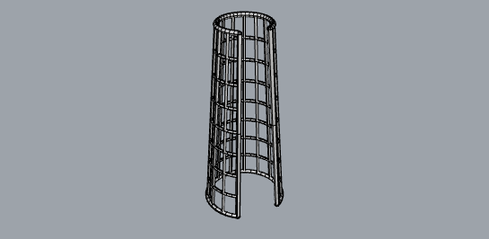
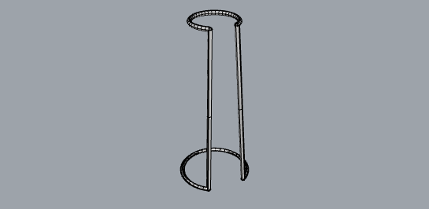
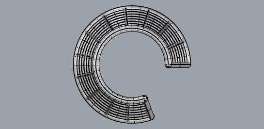
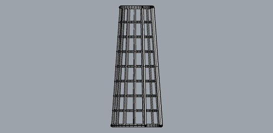

# Parametric forearm orthosis

[](https://github.com/laissezfaire1AI/parametric-orthosis/actions/workflows/validate.yml)

A rule-based Grasshopper definition for a 3D-printed forearm orthosis, with the
product UI described in JSON and a CI job that keeps the two in step.

**Live, no account needed:** https://www.shapediver.com/app/m/orthosis



Seven clinical parameters drive the geometry. Every combination inside the
verified range produces closed, watertight meshes ready for additive
manufacturing.

---

## Why this repository exists

Grasshopper definitions usually live as a binary `.gh` file on somebody's
desktop. That works until a second person depends on them. Then three things
start to hurt:

1. **`.gh` is binary.** `git diff` shows nothing, so review and merge are
   impossible and nobody can tell what changed between two versions.
2. **The UI and the geometry drift apart.** Someone widens a slider range in
   Grasshopper; the product definition still advertises the old one; the person
   filling in the form gets numbers the geometry quietly disagrees with.
3. **Nothing proves the definition survives its own parameter ranges.** It works
   at the values it was built with, and breaks at the edges where real patients
   live.

This repository addresses all three.

---

## How the geometry works

```
forearm circumference ─┐
wrist circumference  ──┼─→ two arc sections ──→ ruled surface (the body)
length               ──┘         │                      │
                                 │                      └─→ naked edges ──→ rim
opening angle ───────────────────┘
                                 │
ribs around    ──→ divide both arcs ──→ line per point pair ──┐
hoops along    ──→ interpolated radius + height ──→ arc per t ─┼─→ pipe ──→ ORTHOSIS
strut thickness ──────────────────────────────────────────────┘
```

The body is a **ruled surface** between the two measured sections. That matters:
a straight line between corresponding points on the two arcs, and an arc at a
linearly interpolated radius and height, both lie exactly on that surface. The
lattice sits on the body by construction, not by projection or approximation.

### The trap this deliberately avoids

The obvious way to draw a lattice on a surface is `Iso Curve` with a grid of UV
points in the 0..1 range. **A lofted surface does not have a 0..1 UV domain.**
Feed it 0..1 and every curve collapses onto one edge — which is exactly what the
first version of this definition did:

| First attempt (isocurves, unreparameterized) | Current (constructed directly) |
| --- | --- |
|  |  |

Grasshopper's fix is a right-click **Reparameterize** flag on the Surface input.
It works, but it is invisible in the graph: nothing on the canvas shows it is
set, and it is trivially lost in a hand-over. Constructing the struts from the
geometry removes the trap instead of papering over it.

---

## Native components only

There are **no C#, Python or VB script components** in this definition, and CI
enforces that.

This is not purism. ShapeDiver allows script components only on paid plans, and
reviews every script by hand before it will run — hours of latency on each
change. A definition that needs manual approval to deploy is not a definition
you can iterate on.

---

## Verification

`tools/verify_orthosis.py` drives every slider to its minimum, midpoint and
maximum, then all-minimum, all-maximum, and a deliberate worst case (thickest
struts, densest lattice, smallest body). For each case it counts solver errors
and inspects every mesh.

```
25 / 25 cases passed
0 solver errors
every case: all meshes valid AND closed (watertight)
```

Full results: [`docs/verify_report.json`](docs/verify_report.json).

| | |
| --- | --- |
|  |  |

---

## The JSON contract

[`product/parameters.json`](product/parameters.json) describes what the clinician
sees: grouping, order, labels in English and German, units, ranges, help text,
and the manufacturing constraints. Each parameter carries a `ghSlider` field
binding it to a Number Slider in the definition.

```json
{
  "id": "strut_thickness",
  "ghSlider": "Strut thickness mm",
  "group": "structure",
  "type": "number", "unit": "mm",
  "min": 1.5, "max": 5.0, "step": 0.1, "default": 3.0,
  "label": { "en": "Strut thickness", "de": "Stegstaerke" }
}
```

`tools/check_parameters.py` reads the `.ghx` as XML — no Rhino, no Windows — and
fails the build on any drift:

- every `ghSlider` binding resolves to a real slider
- `min`, `max` and `default` match the slider exactly
- integer parameters are backed by integer-accuracy sliders
- no slider exists that the JSON does not document
- the declared output component exists
- `scriptComponents: false` is true in fact

A check that never fails proves nothing, so it has its own tests:
`tools/test_check_parameters.py` breaks one thing at a time — a drifted maximum,
an undocumented slider, a mistyped binding, a default outside its own range — and
asserts each is caught. **10 / 10.**

---

## Layout

```
definition/orthosis.ghx      the definition as XML - this is the reviewable source
definition/orthosis.gh       binary, for uploading to ShapeDiver
product/parameters.json      the product / UI contract
product/parameters.schema.json
tools/build_orthosis.py      generates the definition
tools/verify_orthosis.py     parameter sweep + watertightness check
tools/check_parameters.py    JSON <-> definition drift check (pure Python)
tools/test_check_parameters.py
docs/                        renders and the verification report
```

## Rebuilding

Needs Rhino 8 on Windows. Grasshopper ships with it.

```bat
"C:\Program Files\Rhino 8\System\Rhino.exe" /nosplash /runscript="_-RunPythonScript (""tools\build_orthosis.py"") _Exit"
"C:\Program Files\Rhino 8\System\Rhino.exe" /nosplash /runscript="_-RunPythonScript (""tools\verify_orthosis.py"") _Exit"
```

The contract check needs neither:

```bash
pip install jsonschema
python tools/check_parameters.py .
python tools/test_check_parameters.py .
```

---

## Honest limits

- The body is a tapered circular section. A real device starts from a scan of
  the limb; the same rib/hoop construction applies to a scanned surface, but
  this demo does not include scan import or registration.
- Struts are piped and overlap at crossings. Slicers handle that, and every
  individual solid is closed — but this is not a single booleaned watertight
  volume, and the report does not claim it is.
- No clinical validation of any kind. This demonstrates the geometry pipeline
  and the engineering around it, nothing more.
- Padding, strapping, edge rounding and comfort features are out of scope.

---

Janis Vilcins, September 2026.
